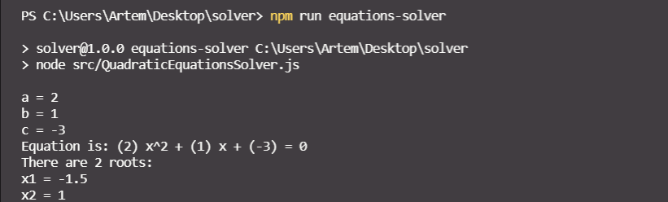
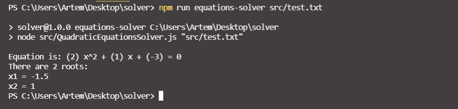

# Quadratic equations solver

It is a console application for solving simple quadratic equations.

### Installation

1. Clone the repo:
   ```sh
   git clone https://github.com/artemmatiushenko1/quadratic-equations-solver.git
   ```
2. Open project's directory and install NPM packages:
   ```sh
   npm install
   ```

### Usage

Application is able to work in two different modes:

- <ins>Interactive mode</ins> - user should input the equation coefficients directly from the console.
  To run this mode execute the following command in the terminal:

  ```sh
    npm run equations-solver
  ```

  An application will ask you to enter `a`, `b` and `c` values. Hit `enter` when you finished entering each value. After the input of the last value the equation roots will be calculated.
  Example:
  

- <ins>Non-interactive / file mode</ins> - the application should recieve a path to the `txt` file while starting, which contains equation coefficients in a special format - `a\sb\sc\n`, where `a`, `b` and `c` are the coefficients of a quadratic equation, `\s` - single whitespace and `\n` - a new line.
  To run this mode execute the following command in the terminal and replace `path/to/file.txt` with your own path to the file with the coefficients:

  ```sh
    npm run equations-solver path/to/file.txt
  ```

  After executing the command above the roots of equation will be immediately calculated.

  Example:
  

### Built with

- Node.js
- JavaScript
- `propmt-sync` npm package

Revert commit - [link](https://github.com/artemmatiushenko1/quadratic-equations-solver/commit/d70b8ced0ea8e51c32f7d92c2faf02561efc8856)
